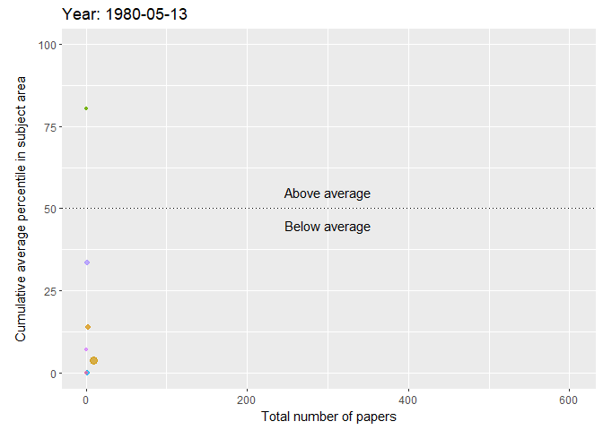

<script src="index_files/htmlwidgets/htmlwidgets.js"></script>
<script src="index_files/pymjs/pym.v1.js"></script>
<script src="index_files/widgetframe-binding/widgetframe.js"></script>


Hello! I have recently finished my master's degree and finished my summer projects! With spare time on my hands, I have finally gotten around to analysing the full list of my university's publications. 

I have run into this dataset during a seminar about InCites, a tool for researchers to look into their university's research, collaborations with other universities and even funding sources. The tool itself is neat, but I saw this as an opportunity to use R and to get to know my university a little better!

# About my university, the Lithuanian University of Health Sciences

The Lithunian University of Health Sciences is one of the biggest universities in the Baltic region. As the name implies, the university specialises in biomedical sciences. In fact, the university attracts the most high school students to study medicine in the country. Historically, the university dates back to the 1920s when it was founded as a medical academy. Later on, in 1998, it was renamed the Kaunas University of Medicine. Finally, the university merged with the Lithuanian Veterinary Academy in 2010 and became the Lithuanian University of Health Sciences.

## The dataset itself

The dataset contains every indexed research paper that contains a co-author from the Lithuanian University of Health Sciences. The total number of publications as of May 31st is 5578 and the database was last updated on July 28th. 


```r
library(tidyverse)
library(tidytext)
library(widyr)
library(igraph)
library(ggraph)
library(highcharter)
library(RColorBrewer)
library(colorRamps)
library(knitr)
library(gganimate)
library(lubridate)
library(ggrepel)
library(widgetframe)
library(magick)


data <- read_csv("data/LSMU_publication_history.csv")

data[data == "n/a"] <- NA
data <- data %>% mutate_at(vars(`Publication Date`:`Journal Impact Factor`), funs(as.numeric))
```

The dataset uses "n/a" instead of R's NA, therefore some tidying is required. Because n/a is recognised as a character, we also need to turn some of the character columns to numeric. I will be doing some data wrangling later but for now this suits our needs.

The dataset does have a few limitations: InCites only lists the first five authors of each paper, limiting the analysis on authorship. Also, research area categories are provided by the InCites database and, unfourtunately, I do not have information about how they are assigned. 

## Publishing throughout the years

Lithuania has gained independence in 1990 and LSMU has merged with the Veterinary academy in 2010 whatever. What is the distribution of papers throughout the years?

}}index_files/figure-html/unnamed-chunk-2-1.png" width="672" />

Interestingly, in 1990 there were no major shifts and up until 1999 the rate of publication had been stable. I couldn't find a clear explanation as to why the rate started increasing - my best guess is that around 1999, international exchange (such as Erasmus) programs had just started. As researchers, doctors and students travelled abroad to work or study, they either gained experience that enabled to conduct research or they established relationships with Western Europe that would facilitate publication.

The period of 2008-2011 is interesting - the number of publications increased despite the financial crisis. In 2010, LSMU (formerly, KMU) merged with the Lithuanian Veterinary Academy, could the merger be masking a decrease in the number of publications? Luckily, the dataset contains information about the research area of the publication. And as for 2018, the year seems to be slow compared to the previous year.

Here is a plot with veterinary sciences seperated from the rest of the papers:


```
## `summarise()` has grouped output by 'Publication Date'. You can override using the `.groups` argument.
```

}}index_files/figure-html/unnamed-chunk-3-1.png" width="672" />

I needed to use grepl because each paper is assigned multiple research areas. The dip we saw previously does seem larger! Let's see how this tendency is reflected in different research areas. To do that, I will use dplyr's separate and gather commands – absolutely indispensable when working with character vectors.

## Which research areas are thriving?

There are a lot of research area categories - certainly not enough to plot them elegantly! Let's try limiting it to the categories that have 150 or more publications.


```
## `summarise()` has grouped output by 'Publication Date'. You can override using the `.groups` argument.
```

}}index_files/figure-html/unnamed-chunk-4-1.png" width="672" />

It does seem cardiac sciences have a similar distribution compared to the overall publication distribution. After tinkering around with plots and failing to find the root cause of the dip, the question is, whose research output decreased the most?


```
## `summarise()` has grouped output by 'Area'. You can override using the `.groups` argument.
```

}}index_files/figure-html/unnamed-chunk-5-1.png" width="672" />

Yeah, we can see cardiovascular sciences and engineering took the biggest hit, however, some of the research areas have produced more papers! I could probably investigate this further by building a linear model and then checking residuals, but this is fine as it is.

## Quality over quantity?

It is pretty evident that the volume of research has increased throughout the years and will probably keep increasing to a certain point. Of course, quality does not equal quantity and in the age of "publish or perish", it would be interesting to check whether researchers publish more papers at the cost of quality.

First, it's interesting to note that almost half (45.32%) of all research papers do not get cited at all:

}}index_files/figure-html/unnamed-chunk-6-1.png" width="672" />

It would be interesting to check how this distribution compares to other universities, but I think that is a question left for another day. Of course, citations cannot solely be used to make decisions about the quality of research. One of the drawbacks is that new papers are very likely to be uncited for a couple of years. Furthermore, really old papers have the misfortune of not appearing in PubMed searches.

Instead of using the number of citations as a metric, I will use InCites' "[Percentile in Subject Area](http://ipscience-help.thomsonreuters.com/inCites2Live/4361-TRS.html)", which shows the relative position of your paper compared to those in the same field. Also, I am going to take the year of publication into account so that we can see how publishing changed over time. To combine all of this, let's use gganimate! I am going to label the largest research areas in the graph - labelling all of them would clutter the plot! 


```
## `summarise()` has grouped output by 'Area'. You can override using the `.groups` argument.
```

<!-- -->

I inversed the percentiles in the plot - the 100th percentile is what every paper should be aiming for and the 0th percentile indicates that a paper has not been cited yet.  It's interesting to see small categories fade in and out of the plot. The plot also shows which areas suffer from publication bloat. In spite of that, around 2017, the quality of cardiovascular and public health papers increased slightly! Also, one of the bigger categories to uphold a higher percentile value is gastroenterology – kudos to them! Overall, the plot looks promising - even though the university produces research that gets outranked by other universities, over time, a lot of the categories have had their percentiles increase.

## Who works with whom?

Since the publications have authors listed alongside in the data, I would like to know whether research groups work independently or cooperate with other groups. Unfourtunately, InCites provides only the first 5 authors of each paper. Obviously, this means that we lose any information about authors who are credited after the fifth author. But more importantly, usually papers list the supervisor as the last author. This means that some of the most important connections between authors may become lost. This may cause some of the author clusters to be isolated when in fact they are connected by someone. *Finally*, I have added a threshold of 4 publications to show common authorship. Adding more produced a highly interconnected plot that was hard to parse. With these caveats in mind, let's look at clusters of authors!


```
## `summarise()` has grouped output by 'Author'. You can override using the `.groups` argument.
```

<div id="htmlwidget-1" style="width:100%;height:400px;" class="widgetframe html-widget"></div>
<script type="application/json" data-for="htmlwidget-1">{"x":{"url":"index_files/figure-html//widgets/widget_unnamed-chunk-8.html","options":{"xdomain":"*","allowfullscreen":false,"lazyload":false}},"evals":[],"jsHooks":[]}</script>

Luckily, the clusters are not completely isolated, suggesting that research teams do collaborate at the university. It's interesting to see which research groups work together – an obvious example that is reflected in the plot is pulmonology, allergology and laryngology. In certain clusters, it is pretty easy to see department heads because they are in the center of their respective clusters. Also, some teams do seem to work independently, however I wouldn't make any conclusions based on the limitations of the dataset and the plot. Nonetheless, we did get some insights from the visualisation!

The plot was built using highcharter - I have tried to initially use plotly to make it interactive, however, coding in highcharter proved to be more convenient. Also, since each paper has multiple research areas, so too does each author have multiple areas. I have kept the research area in which an author has produced the most publications.

## In conclusion

Whew, we are done! What have we learned today?

1) The financial crisis of 2007–2008 did affect the research output.
2) A large portion or research papers are left uncited!
3) The quality of papers in some of the research areas is lower at the cost of quantity.

As for the code, it can be found in the blog's repository. What's great is that this code will work with any dataset exported from InCites' database. I might try and compare different universities (locally or globally) in the future!

